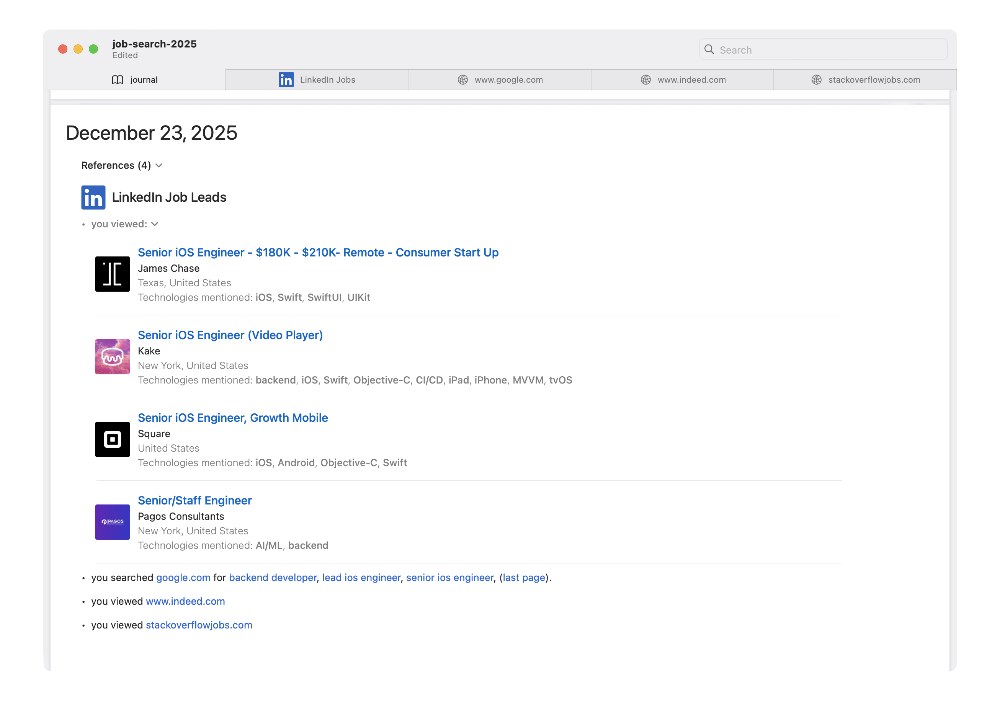

# Evolve your software job search

The tech industry is not for the weak.  Our skills are 
[depreciating faster than ever before](https://www.forbes.com/sites/joemckendrick/2023/10/14/half-of-all-skills-will-be-outdated-within-two-years-study-suggests/) and the [competition to find new roles is higher than almost every other industry](https://devsu.com/blog/navigating-software-developer-turnover-challenges).  We've all embraced the need to plan our careers carefully, learn constantly, and adapt quickly to succeed.  When you leave the certainty of one job in search of another, why should your methodology be any different?

**NextRole** organizes and supports your job change by tightly integrating documentation, discovery, and analytics into a single app experience for macOS.

## Documentation

**NextRole** is a specialized journal to track your job search.  You're not documenting your life's work, but what makes your life's work possible, so it prioritizes quick updates and <a href="https://commonmark.org" target="_blank" rel="noopener">clean formatting</a>.  That way you can keep notes without learning anything new and get back to your priorities.

## Discovery

Including specialized job search and integrated browsing into **NextRole** makes it easier to update your journal about exciting leads while the app organizes what you found. 

## Analytics

The combination of documentation, specialized search and integrated browsing allows **NextRole** to update your journal with useful context.  As you add notes and **NextRole** automatically adds analytics, the documentation grows more informative over time, creating a virtuous cycle and an even better resource tomorrow.

## Land your best job

The industry is a lot different than it was even five years ago.  It is no longer sufficient to have picked up a hot technology, sent out a handful of resumes, all the while expecting to get our choice of offers.  Now that we have AI interviewing us and the smallest companies are building software with massive scale, the goalposts for our skills are moved by miles farther every year with the next developer conference or third-party partnership.

If you agree that you should organize your job search like the rest of your work, you could cobble a plan together with Notes, Safari and Numbers...

Or just use **NextRole** and get back to coding.

Your choice.
